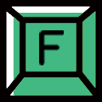

	

<h1 align=center id='f-typing'>F-Typing</h1>

<strong>基于 <em>Vue3</em> + <em>Quasar</em> 的在线打字网站</strong>

    
   
    
    

### 特点

- **支持自定义词组**
- **可定制主题颜色**

### 开发环境

- Node.js 18.19.1
- @vue/cli 5.0.8
- @quasar/cli v2.3.0

### 在线访问

<a href='https://f-typing.top/' target='_blank'>https://f-typing.top/</a>
